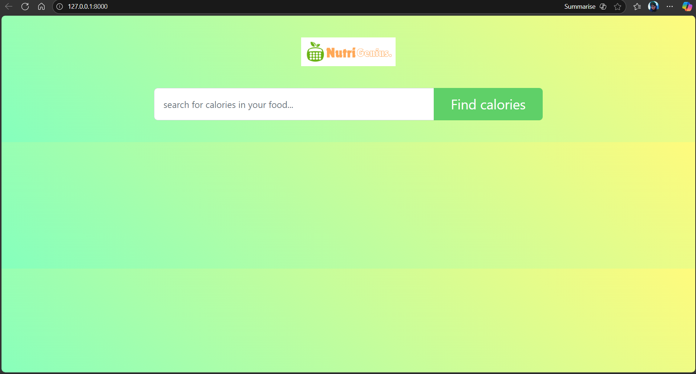

# NutriGenius

*A simple nutrition lookup & calorie tracker built with Django*

## Overview

NutriGenius is a web app that lets users quickly look up the nutritional information of everyday foods and see how long they would need to exercise to burn those calories.
The app calls a public nutrition API from a Django backend and displays:

- A clean, gradient UI with a search bar
- A nutrition table (carbs, fats, protein, sodium, etc.)
- Activity suggestions (jogging, yoga, gym workout, brisk walk) with estimated minutes

It was built to practice full-stack development: API integration, server-side rendering with Django templates, and custom styling.

## Features

- **Food search** – search for any food item and get its calorie count.
- **Nutrition breakdown** – table showing carbs, cholesterol, fat, protein, sodium, sugar, and more per 100g serving.
- **Exercise suggestions** – approximate time required to burn those calories via:
  - Jog
  - Power Yoga
  - Gym Workout
  - Brisk Walk
- **High sodium alert** – shows a warning banner if the food is high in sodium.
- **Responsive UI** – gradient background, centered card layout, works on desktop and laptop screens.

## Tech Stack

- **Backend:** Python 3, Django
- **Frontend:** HTML, CSS, Bootstrap, a bit of vanilla JavaScript
- **Database:** SQLite (default Django development DB)
- **HTTP/API:** `requests` to call the nutrition API

## Screenshots

Create a folder `screenshots/` in the project root and place your screenshots there.
Update the filenames below if you use different names.

### Home Page

_Search screen with gradient background and logo._



### Results Page

_Nutrition table and activity suggestions for a searched food (e.g., omelette)._


## Installation & Setup

### Prerequisites

- Python 3.8+
- `pip` (Python package manager)

### 1. Clone the repository

```bash
git clone https://github.com/<your-username>/Nutri-Genius.git
cd Nutri-Genius
```

### 2. Create and activate a virtual environment

```bash
python -m venv venv

# Windows
venv\Scripts\activate

# macOS / Linux
source venv/bin/activate
```

### 3. Install dependencies

If `requirements.txt` exists:

```bash
pip install -r requirements.txt
```

Otherwise, minimal install:

```bash
pip install django requests
```

### 4. Configure the nutrition API key

1. Obtain an API key from your chosen nutrition API provider.
2. In the Django view that makes the HTTP request (e.g. `counter/views.py`), set the API key:
   - either hard-code it for local testing, or
   - read it from an environment variable like `NUTRITION_API_KEY`.

Example (environment variable approach):

```python
import os
API_KEY = os.getenv("NUTRITION_API_KEY")
```

### 5. Apply database migrations

```bash
python manage.py migrate
```

### 6. Run the development server

```bash
python manage.py runserver
```

Open the app in your browser at:

```text
http://127.0.0.1:8000/
```

## Usage

1. Open the home page.
2. Enter a food item (e.g. `omelette`, `banana`, `grilled chicken`) in the search box.
3. Click **Find calories**.
4. View:
   - Total calories for that item.
   - A nutrition table showing macro and micro nutrient values per 100 grams.
   - A sodium warning banner if applicable.
   - Estimated time required to burn those calories by:
     - Jogging
     - Doing Power Yoga
     - Getting a Gym Workout
     - Going for a Brisk Walk

That’s it — you now have a basic nutrition lookup and calorie-burn estimator running locally.
